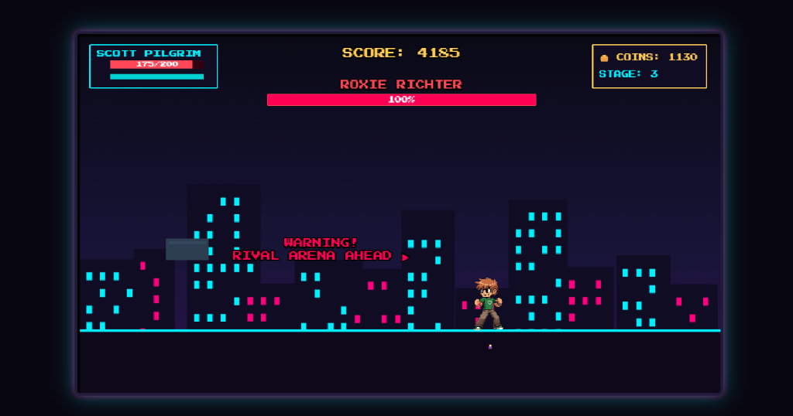
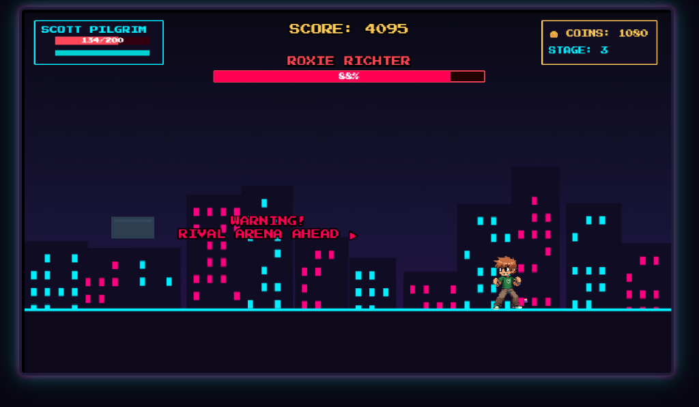
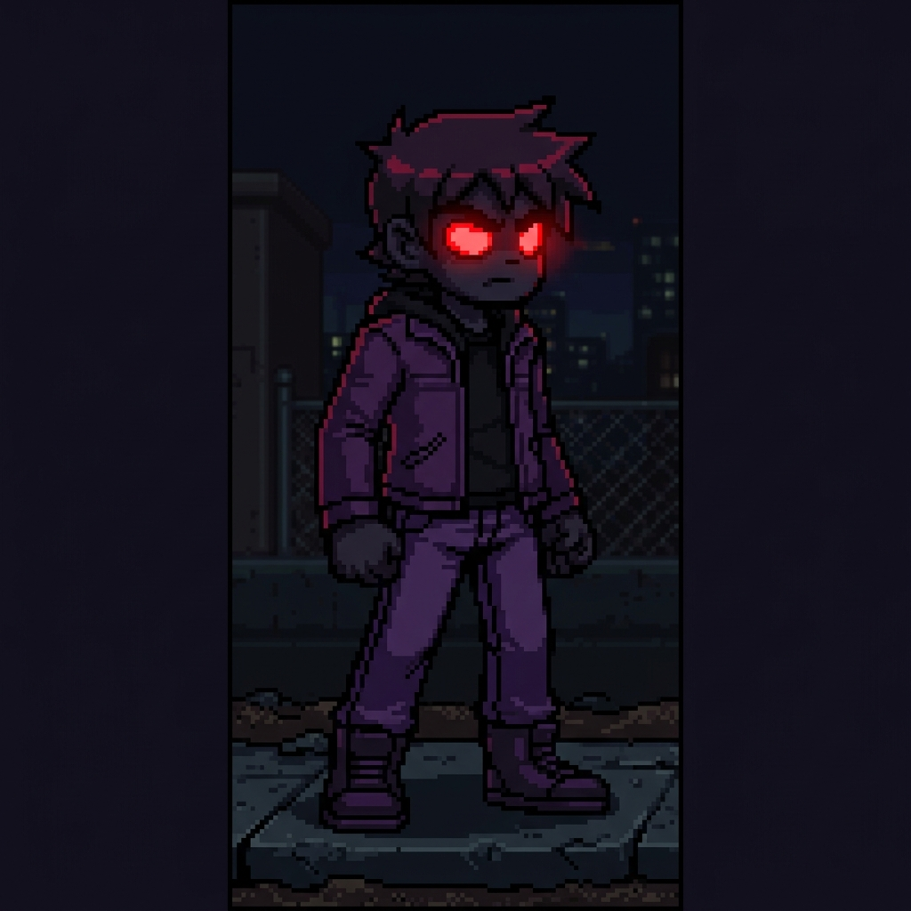

# RIVAL RUSH: RISE OF THE SEVEN 🎯

A fast-paced 2D retro arcade beat-'em-up game inspired by classic arcade brawlers, featuring comic-book energy, keyboard combat mechanics, dynamic procedural pixel art, and a 7-stage boss rush!

---

## Basic Details

### Team Members
- **Team Lead**: Glena Maries Dias
- **Team Member**: Akza Treesa Mathews

### Team Collaboration & Equal Participation
This project was developed under a joint **Equal Collaboration System** with **equal (50% - 50%) participation** from both team members across all stages of project design, game architecture, graphics rendering, sound synthesis, and documentation:
- **Glena Maries Dias (Team Lead)**: Lead Systems & Gameplay Architect — Game logic state machine, combat mechanics, rival boss AI algorithms, upgrade shop system, and scene routing.
- **Akza Treesa Mathews (Team Member)**: Lead Graphics & Sound Engineer — Procedural pixel art texture generator, Web Audio API 8-bit sound synthesizer, UI HUD elements, sprite animations, and stage level design.

---

### Project Description
A fully functional browser-based retro 2D arcade beat-'em-up game built from scratch using HTML5, JavaScript (ES6+), and Phaser.js 3. Face off against the League of Seven Rivals across 7 escalating stages, mastering combos, dodges, special attacks, and stage progression.

### The Problem (that doesn't exist)
Dating someone shouldn't require physically battling their seven increasingly theatrical evil exes across movie sets, vegan concert stages, and chaos theatres with custom boss AI and supersonic treble waves.

### The Solution (that nobody asked for)
An arcade beat-'em-up that lets you play as Scott Pilgrim, jump into neon-lit city streets, pummel hipster demons, skaters, and vegan telekinetics with responsive keyboard controls, collect coins and XP for stat upgrades, and reunite with Ramona Flowers!

---

## Screenshots & Demo Video

### Screenshots

| Retro Arcade Main Menu | Stage Brawling & Combat |
|:---:|:---:|
|  <br> *Main Menu & Stage Selection System* |  <br> *In-game beat-'em-up combat action* |

| Character & Boss Encounter | Upgrade Shop & Stat Boosting |
|:---:|:---:|
|  <br> *Rival Arena Boss Encounter* |  <br> *In-game shop for spending coins on stat upgrades* |

| Victory & Story Conclusion | Shadow Rival Sprite Art |
|:---:|:---:|
|  <br> *Defeating the rivals to reunite with Ramona* |  <br> *Custom Boss Pixel Art Renderings* |

---

### Demo Working Video

📹 **Project Demo Video Recording**:

<video src="images/Screen%20Recording%202026-09-04%20074442.mp4" controls="controls" width="100%"></video>

*Note: If the video player above does not play directly in your viewer, you can access the raw demo recording in the repository at [`images/Screen Recording 2026-09-04 074442.mp4`](file:///c:/Users/ADMIN/Desktop/rival-rush/images/Screen%20Recording%202026-09-04%20074442.mp4).*

---

## Story & Rivals Structure

* **Protagonist**: Scott Pilgrim (Playable fighter)
* **Story Partner**: Ramona Flowers (Appears in the victory sequence)

### The Seven Rivals
1. **Stage 1**: **Matthew Patel** — First Evil Ex (Mystic Fireballs & Demon Hipster Chicks)
2. **Stage 2**: **Lucas Lee** — Skater / Action Star (Skateboard Grind Charge & Heavy Stunt Slam)
3. **Stage 3**: **Roxie Richter** — Half-Ninja (Ninja Teleportation & Shadow Whip Slash)
4. **Stage 4**: **Nega Scott** — Shadow Doppelganger (Shadow Dash & Dark Energy Pulses)
5. **Stage 5**: **Kyle & Ken Katayanagi** — Conjoined-Twin Duo Boss (Synchronized sonic pulses)
6. **Stage 6**: **Todd Ingram** — Vegan Bassist (Vegan Telekinetic Pulses & Forcefield Push)
7. **Stage 7**: **Gideon Graves** — Final Boss (4-Phase Arena Battle with Subspace attacks)

---

## Controls

| Key | Action |
|---|---|
| **A** / **←** | Move Left |
| **D** / **→** | Move Right |
| **W** / **↑** / **Space** | Jump |
| **J** | Light Attack (Punch / Kick combo) |
| **K** | Heavy Attack / Special Energy Attack (if energy ≥ 30) |
| **L** | Invincible Dash (I-frames & ghost trail) |
| **ESC** | Pause Menu |

---

## Technical Details

### Technologies Used
- **Languages**: HTML5, CSS3, JavaScript (ES6+ Modules)
- **Game Engine**: Phaser.js 3 (Arcade Physics)
- **Audio**: Web Audio API (Procedural 8-bit sound synthesizers & dynamic BGM)
- **Storage**: LocalStorage Save/Load system (persisting high scores, coins, XP, and unlockable upgrades)
- **Server**: Lightweight zero-dependency Node.js HTTP server

### Project Architecture
- `src/scenes/`: BootScene, MenuScene, CharacterSelectScene, LevelScene, UpgradeScene, VictoryScene, GameOverScene, PauseScene
- `src/entities/`: Player, Enemy, Boss, Pickup
- `src/bosses/`: Custom AI implementations for all seven rivals (MatthewPatel, LucasLee, RoxieRichter, NegaScott, KatayanagiTwins, ToddIngram, GideonGraves)
- `src/enemies/`: Street Punk, Runner, Bruiser, Ranged Enemy
- `src/systems/`: CombatSystem, TextureGenerator, AudioManager, SaveSystem
- `src/data/`: bossData, playerData, enemyData
- `src/ui/`: In-game HUD (floating health bars, combo counter, boss status)

---

## Implementation & How to Run

### Installation & Run
No heavy dependencies needed! Run directly with Node.js:

```bash
# Clone the repository
git clone https://github.com/akza007/useless_project_temp.git
cd useless_project_temp

# Start the game server
node server.js
```

Then open your browser and navigate to:
**http://localhost:3000**

---

Made with ❤️ at TinkerHub Useless Projects


